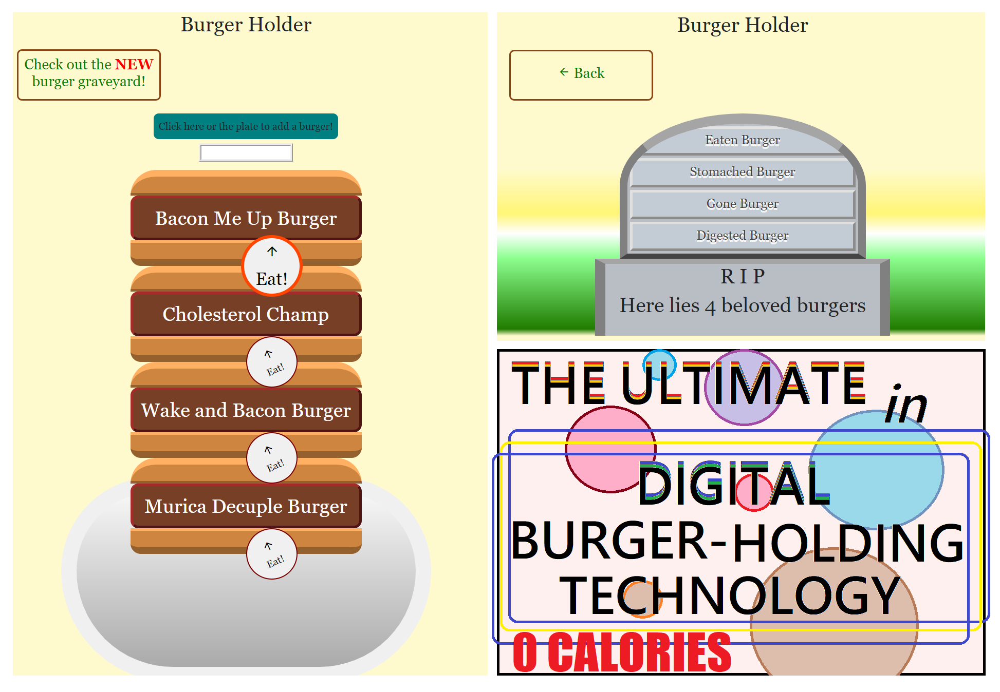

# [Burger Holder](https://burgerholder.herokuapp.com/)
## The best choice for all your digital burger holding needs.

Digital burger holding and mastication has never been easier than with the all new Burger Holder™. With user-entered burger generation, Burger Holder™ burger holding possibilities are endless. Name the burger! Eat the burger! Visit the burger's grave! Become the burger. Remember to connect with your ancestral burgers by taking a stroll by the Burger Graveyard!

## How to start the fulfillment of your burger holding dreams

Burger Holder™ is incredibly malleable when it comes to serving your burger holding needs. You can visit us at:

https://burgerholder.herokuapp.com/

That's where you can find us, 24/7, ready to serve your digital burger holding needs at a moment's notice. Get your burger holding fix when and where you want. Visit us on your phone!

To run your own, fantastical version of Burger Holder™ (the all new demi-god of the digital burger holding market), feel free to visit our github repository at:

https://github.com/TheMatthewSawyer/burger_holder

Cloning and crafting your own burger holding vision has never been so easy! Use a text/code editor of your choice. Burger Holder™ is easiest to edit when run off a local server with a mySql database backing it. You will need to install and run all necessary programs. Links are listed below.

## Testing the Robust Refined Best Burger Holding Handiwork Ever Experienced
Feel free, friend, to forgo foolish furnishment of fulsome freeware. Tactful testing takes:
* A web browser
    * (with chrome you can edit the public code live!)
* Downloading and running your own version
    * (see the github link listed above)

## Built with

* Microsoft Visual Studio Code
    * https://code.visualstudio.com/
* Bootstrap
    * https://getbootstrap.com/
* jQuery
    * https://jquery.com/
* GitHub
    * https://github.com/
* Heroku
    * https://www.heroku.com
* Material Icons
    * https://material.io/resources/icons/?style=baseline
* MySQL
    * https://www.mysql.com/
* jawsDB
    * https://www.jawsdb.com/
* Handlebars
    * https://handlebarsjs.com/
* Node.js
    * https://nodejs.org/en/
* Express
    * http://expressjs.com/

For a full list of all dependencies Burger Holder™, the burger holder for the technically minded, future forward individual, runs off of, please visit our github and have a scroll the package and package-lock files.